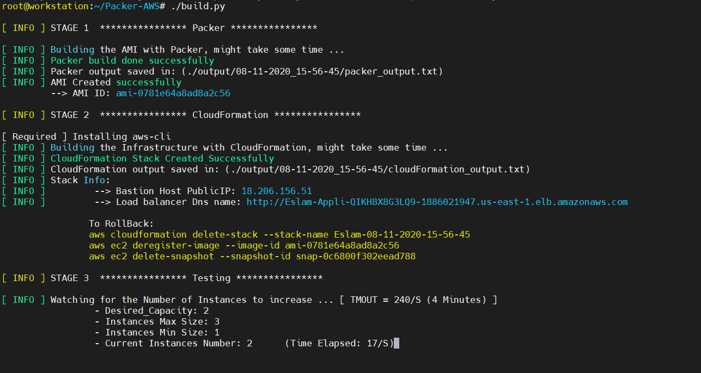
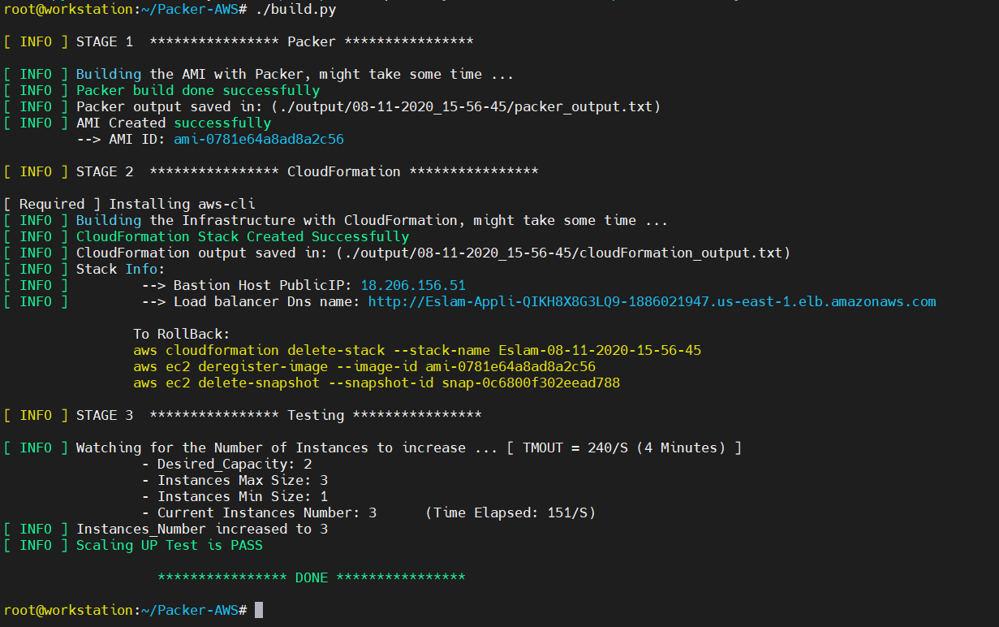

# Task: 

**The attached code does the following:**

* Creates an AMI image with Packer
* Builds an infrastructure with CloudFormation (EC2, ALB, ASG)
* Perform Live testing for ASG Scaling UP


---

## Usage

#### Requirementes

* Linux Machine
    * with `wget` installed (To install `aws-cli` if not installed)
        * alternatively; you can install `aws-cli` manually.

`NOTE` `->` The `aws-cli` tool is needed to run the CloudFormation file as well as getting some info

```bash
su root # Important for installing somedependencies - Like aws-cli (If Needed)

tar -xvf packer.tar.gz
chmod +x packer
chmod +x build.py

export AWS_ACCESS_KEY_ID=""
export AWS_SECRET_ACCESS_KEY=""
export AWS_DEFAULT_REGION="us-east-1" # Changing the Region might require changing the ami that Packer uses

./build.py
```


---


## Example







Thank you

[Eslam Gomaa](https://www.linkedin.com/in/eslam-gomaa/)


